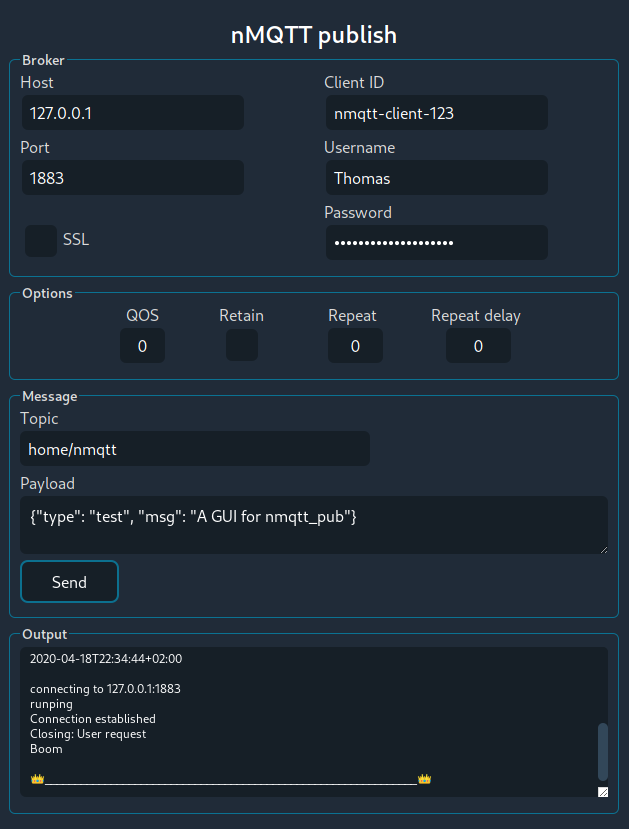

# nmqttgui

A GUI for [nmqtt](https://github.com/zevv/nmqtt) - a native Nim MQTT library and client.

## This is WORK IN PROGRESS.

Currently there is 1 file, `nmqttgui`, which is a POC for wrapping `nmqtt_pub`.
The future development needs to define a structure for this Nimble package -
should it include 1 file which is a publisher, subscriber and broker? Or a
single file for each of them like `nmqtt` provides.

All combined in 1:
* Use tabs?
* Scroll?
* New windows?
* Hide/show divs?

____

Powered by [nmqtt](https://github.com/zevv/nmqtt), [Nim](http://nim-lang.org) and [WebGUI](https://juancarlospaco.github.io/webgui)

____

**Screenshots:**

